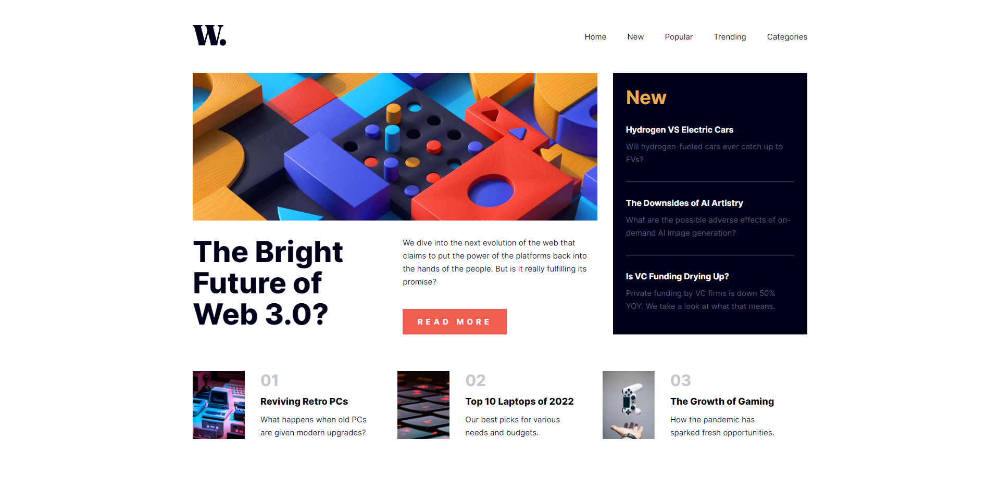
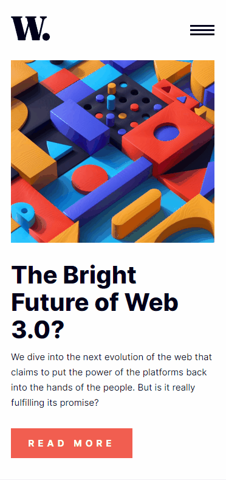

<div align="center" style="margin-bottom: 10px;">
  
</div>
<h1 align="center">
  Homepage de Notícias
</h1>
<p align="center">
    Página única do homepage de um website de notícias <a href="https://jonathanbenedito.github.io/portfolio" target="_blank">jonathanbenedito.github.io/news-homepage</a>. Desenvolvido para um desafio do Frontend Mentor.
</p>




## Table of contents

- [Guia de instalação](#guia-de-instalação)
- [Sobre o projeto](#sobre-o-projeto)
  - [O desafio](#o-desafio)
  - [Fotos (Mobile)](#fotos-mobile)
  - [Links](#links)
  - [Tecnologias](#tecnologias)

## Guia de instalação

1. Faça o clone do projeto
    ```
    git clone https://github.com/jonathanBenedito/news-homepage.git
    ```

2. Acesse o repositório
    ```
    cd news-homepage
    ```

## Sobre o projeto

### O desafio

A proposta é construir a homepage usando preferencialmente o CSS grid, o menu de navegação deve encolher em um botão quando for exibida nos dispositivos mobile. O website deve aparentar o mais próximo possível do layout fornecido pelo desafio.

### Fotos (Mobile)

<div style="display: flex; margin-top: 15px; gap: 20px;">
    
    
        
</div>

### Links

Website: <a href="https://jonathanbenedito.github.io/news-homepage/">jonathanbenedito.github.io/news-homepage/</a>
Desafio do Frontend Mentor: <a href="https://www.frontendmentor.io/challenges/news-homepage-H6SWTa1MFl">jonathanbenedito.github.io/news-homepage/</a>

### Tecnologias

O website foi construído usando apenas HTML5 e CSS3.


          